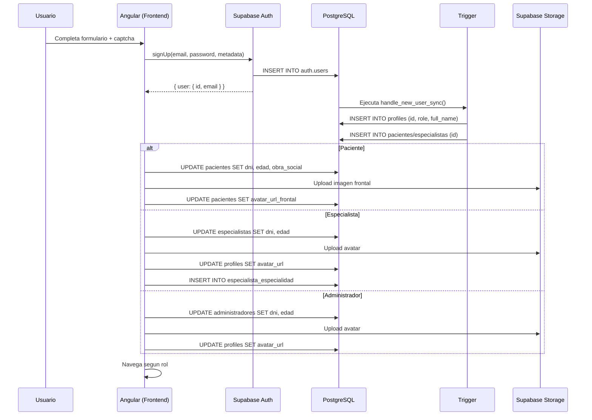

# Clinica Online 2026

Plataforma SaaS de administracion clinica digital, disenada para la gestion integral de pacientes, especialistas y personal administrativo en entornos de salud modernos.

---

## Vision General y Enfoque SaaS

Clinica Online 2026 es un sistema de administracion clinica construido sobre una arquitectura frontend modular y escalable. La plataforma resuelve la operacion diaria de centros medicos mediante un modelo multiperfil que segmenta funcionalidades por rol: pacientes, especialistas y administradores.

El sistema opera sobre un modelo de identidad centralizado donde Supabase Auth actua como proveedor de autenticacion unico, mientras que las tablas de extension en PostgreSQL almacenan los atributos especificos de cada perfil. Esta separacion permite escalar dominios funcionales de forma independiente sin comprometer la integridad referencial.

---

## Stack Tecnologico Core

| Capa | Tecnologia | Version |
|------|------------|---------|
| Framework | Angular (Standalone Components) | 19.x |
| Estado Reactivo | Angular Signals + Computed | Nativo |
| Control Flow | New Control Flow (@if, @for, @switch) | Nativo |
| Estilos | Tailwind CSS | 4.x |
| Backend即服务 | Supabase (Auth, Database, Storage, Realtime) | 2.109+ |
| Iconografia | Lucide Angular | 1.23+ |
| Notificaciones | ngx-sonner | 3.1+ |
| Lenguaje | TypeScript (strict mode) | 5.7+ |

---

## Arquitectura Frontend

La aplicacion sigue un patron de desacoplamiento por dominios funcionales, donde cada capa tiene responsabilidades exclusivas y comunicacion unidireccional.

```
src/app/
  core/          -- Servicios singleton, guards, interceptores, modelos y animaciones globales
  features/      -- Modulos de negocio lazy-loaded (administration, authentication, landing, etc.)
  shared/        -- Componentes, directivas, pipes y modelos reutilizables
  layouts/       -- Layouts shell (auth-layout, dashboard-layout)
```

### Path Aliases

El proyecto configura aliases de importacion en `tsconfig.json` para eliminar dependencias circulares y mejorar la legibilidad:

- `@core/*` -> `src/app/core/*`
- `@shared/*` -> `src/app/shared/*`
- `@layouts/*` -> `src/app/layouts/*`
- `@features/*` -> `src/app/features/*`
- `@env/*` -> `src/environments/*`

### Convenciones de Componentes

- Cada componente utiliza `templateUrl` y `styleUrl` con archivos externos (.html, .scss).
- Los componentes son Standalone (sin NgModule).
- El control de estado se realiza exclusivamente con Angular Signals.
- Los comentarios inline estan prohibidos; la documentacion utiliza JSDoc en espanol.

---

## Modelo de Identidad y Persistencia (Backend)

Supabase Auth gestiona el ciclo de vida de autenticacion. Al registrarse un usuario, el payload de metadatos (role, full_name, dni, edad) se envia dentro de `options.data` del metodo `signUp()`.

Un trigger de PostgreSQL (`handle_new_user_sync`) se ejecuta de forma sincronica sobre la tabla `auth.users` y popula las tablas de extension:

| Tabla | Campos | Proposito |
|-------|--------|-----------|
| `profiles` | id, email, full_name, avatar_url, role | Perfil base comun a todos los roles |
| `pacientes` | id, dni, edad, obra_social | Atributos exclusivos del paciente |
| `especialistas` | id, dni, edad, is_approved | Atributos del especialista + control de aprobacion |
| `administradores` | id, dni, edad | Atributos del administrador |

La subida de imagenes de perfil se gestiona mediante Supabase Storage con la ruta `user-profiles/{UUID}/avatar.png`.

---

## Seguridad y Control de Accesos

### Angular Functional Guards

El sistema implementa guards funcionales asincronos que validan el estado de sesion y el rol del usuario antes de resolver la ruta:

- **authGuard**: Verifica la existencia de sesion activa. Redirige a `/login` si no hay sesion.
- **roleGuard**: Valida que el rol del usuario coincida con la ruta solicitada. Bloquea especialistas no aprobados redirigiendo a `/approval-pending`.
- **sessionReady**: Promesa que se resuelve en el `finally` del metodo `initializeSession()`, garantizando que los guards no evaluen estado incompleto tras recarga de pagina.

### Row Level Security (RLS)

Supabase aplica politicas RLS a nivel de base de datos que restringen las operaciones segun el rol del usuario autenticado:

- Los pacientes solo pueden leer/escriturar sus propios registros.
- Los especialistas solo acceden a pacientes asignados.
- Los administradores tienen acceso completo a la tabla `profiles` y pueden gestionar usuarios.

### Aislamiento de Sesion en Creacion de Usuarios

El panel de administracion utiliza un cliente Supabase aislado (`tempClient`) con `persistSession: false` para crear usuarios sin afectar la sesion del administrador activo. Los metadatos de extension (dni, edad) se persisten mediante `.update()` sobre la tabla correspondiente, evitando conflictos de clave duplicada con el trigger automatico.

---

## Diagrama Tecnico del Flujo de Registro



---

## Estado del Roadmap

| Sprint | Nombre | Estado | Componentes |
|--------|--------|--------|-------------|
| Sprint 0 | Configuracion de Entorno | Completado | Angular 19, Tailwind CSS v4, Supabase SDK, Path Aliases, Estructura de carpetas |
| Sprint 1 | Autenticacion y Sistema Multiperfil | Completado | Landing, Login, Register (3 perfiles), Guards, Dashboard Layout, Admin Users Panel, Paginacion reactiva, Toasts semanticos, Realtime |
| Sprint 2 | Turnos y Citas Medicas | Planificado | Reservacion de turnos, calendario, notificaciones |
| Sprint 3 | Historia Clinica | Planificado | Registro medico, signos vitales, adjuntos |
| Sprint 4 | Estadisticas y Reportes | Planificado | Dashboard administrativo, graficos, exportacion |
| Sprint 5 | Optimizacion y Despliegue | Planificado | Performance, testing e2e, CI/CD, despliegue Vercel |

---

## Inicio Rapido

```bash
# Instalar dependencias
npm install --legacy-peer-deps

# Ejecutar en modo desarrollo
ng serve

# Construir para produccion
ng build --configuration=production
```

### Variables de Entorno

Configurar el archivo `src/environments/environment.ts` con las credenciales de Supabase:

```typescript
export const environment = {
  production: false,
  supabaseUrl: 'https://tu-proyecto.supabase.co',
  supabaseKey: 'tu-anon-key',
};
```

---

## Licencia

Proyecto privado. Todos los derechos reservados.
