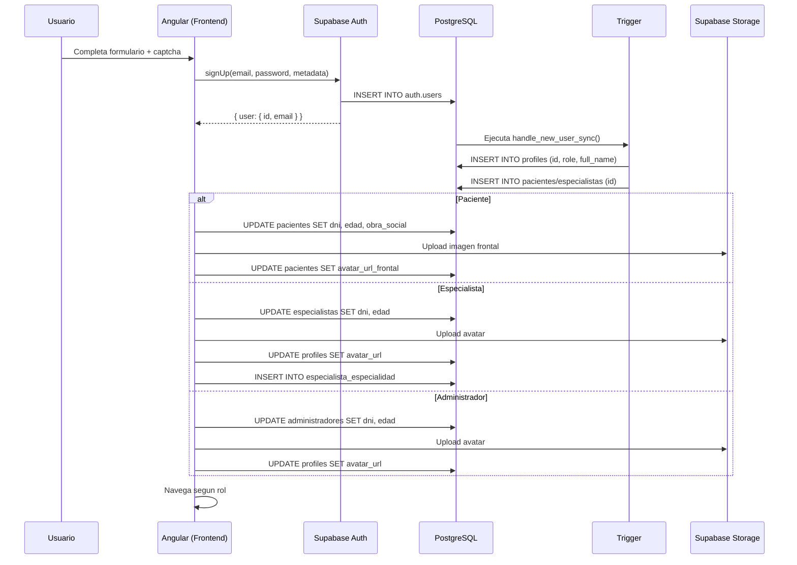
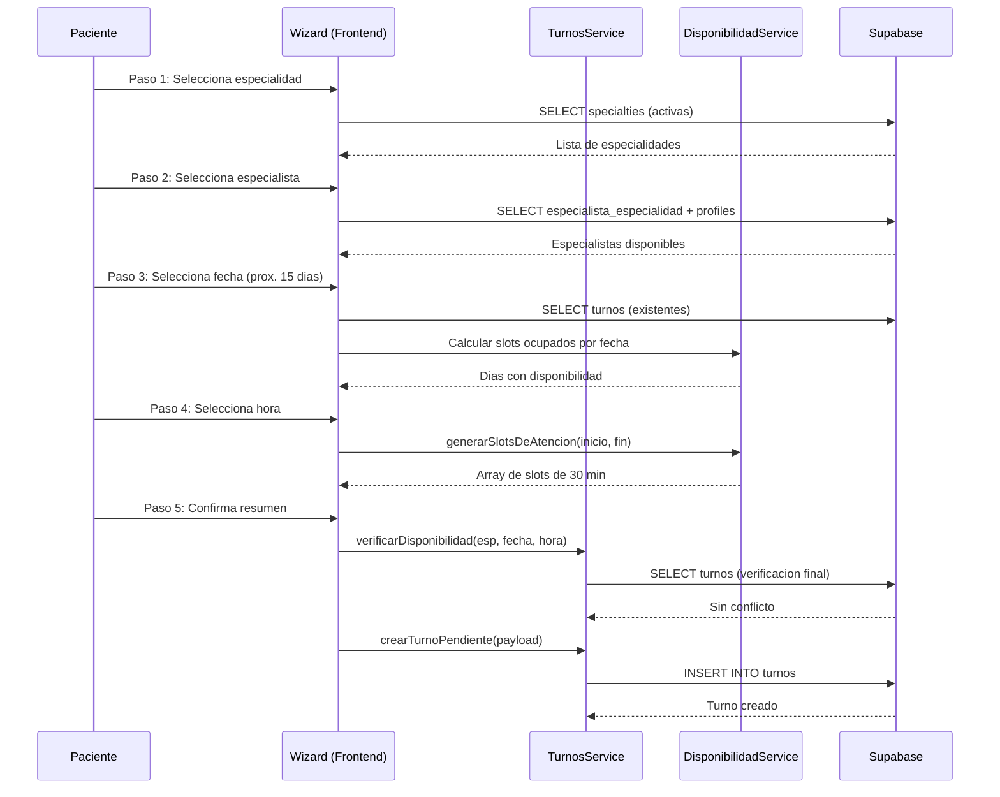

# Clinica Online 2026

Plataforma SaaS de administracion clinica digital, disenada para la gestion integral de pacientes, especialistas y personal administrativo en entornos de salud modernos.

---

## Vision General y Enfoque SaaS

Clinica Online 2026 es un sistema de administracion clinica construido sobre una arquitectura frontend modular y escalable. La plataforma resuelve la operacion diaria de centros medicos mediante un modelo multiperfil que segmenta funcionalidades por rol: pacientes, especialistas y administradores.

El sistema opera sobre un modelo de identidad centralizado donde Supabase Auth actua como proveedor de autenticacion unico, mientras que las tablas de extension en PostgreSQL almacenan los atributos especificos de cada perfil. Esta separacion permite escalar dominios funcionales de forma independiente sin comprometer la integridad referencial.

---

## Stack Tecnologico Core

| Capa | Tecnologia | Version |
|------|------------|---------|
| Framework | Angular (Standalone Components) | 19.x |
| Estado Reactivo | Angular Signals + Computed | Nativo |
| Control Flow | New Control Flow (@if, @for, @switch) | Nativo |
| Estilos | Tailwind CSS | 4.x |
| Backend即服务 | Supabase (Auth, Database, Storage, Realtime) | 2.109+ |
| Iconografia | Lucide Angular | 1.23+ |
| Graficos | Chart.js + ng2-charts | 4.5+ / 10.0+ |
| Exportacion | jsPDF + xlsx (SheetJS) | 4.2+ / 0.18+ |
| Notificaciones | ngx-sonner | 3.1+ |
| Lenguaje | TypeScript (strict mode) | 5.7+ |

---

## Arquitectura Frontend

La aplicacion sigue un patron de desacoplamiento por dominios funcionales, donde cada capa tiene responsabilidades exclusivas y comunicacion unidireccional.

```
src/app/
  core/          -- Servicios singleton, guards, interceptores, modelos y animaciones globales
  features/      -- Modulos de negocio lazy-loaded (administration, authentication, landing, etc.)
  shared/        -- Componentes, directivas, pipes y modelos reutilizables
  layouts/       -- Layouts shell (auth-layout, dashboard-layout)
```

### Path Aliases

El proyecto configura aliases de importacion en `tsconfig.json` para eliminar dependencias circulares y mejorar la legibilidad:

- `@core/*` -> `src/app/core/*`
- `@shared/*` -> `src/app/shared/*`
- `@layouts/*` -> `src/app/layouts/*`
- `@features/*` -> `src/app/features/*`
- `@env/*` -> `src/environments/*`

### Convenciones de Componentes

- Cada componente utiliza `templateUrl` y `styleUrl` con archivos externos (.html, .scss).
- Los componentes son Standalone (sin NgModule).
- El control de estado se realiza exclusivamente con Angular Signals.
- Los comentarios inline estan prohibidos; la documentacion utiliza JSDoc en espanol.

---

## Modelo de Identidad y Persistencia (Backend)

Supabase Auth gestiona el ciclo de vida de autenticacion. Al registrarse un usuario, el payload de metadatos (role, full_name, dni, edad) se envia dentro de `options.data` del metodo `signUp()`.

Un trigger de PostgreSQL (`handle_new_user_sync`) se ejecuta de forma sincronica sobre la tabla `auth.users` y popula las tablas de extension:

| Tabla | Campos | Proposito |
|-------|--------|-----------|
| `profiles` | id, email, full_name, avatar_url, role | Perfil base comun a todos los roles |
| `pacientes` | id, dni, edad, obra_social, avatar_url_frontal, avatar_url_secundario | Atributos exclusivos del paciente |
| `especialistas` | id, dni, edad, is_approved | Atributos del especialista + control de aprobacion |
| `administradores` | id, dni, edad | Atributos del administrador |

La subida de imagenes de perfil se gestiona mediante Supabase Storage con la ruta `avatars/{UUID}/avatar.{ext}`.

---

## Arquitectura de Gestion de Citas y Ciclo de Vida de Turnos

### Evolucion Modular

El modulo de turnos (`features/appointments/`) se organiza en dos dominios claramente separados, accesibles desde la ruta `/turnos`:

```
features/appointments/
├── dashboard/                -- Gestion y auditoria de turnos
│   ├── pages/dashboard-page/ -- Contenedor smart (filtros, busqueda, paginacion)
│   ├── components/turno-card/-- Tarjeta presentacional por turno
│   └── dialogs/              -- Modales de cancelacion, rechazo, resena, calificacion
├── request/                  -- Asistente de solicitud para pacientes
│   ├── pages/request-page/   -- Contenedor del wizard
│   ├── services/             -- WizardTurnoService (estado reactivo del wizard)
│   └── components/           -- 5 pasos: especialidad, especialista, fecha, hora, confirmacion
└── appointments.routes.ts    -- Enrutamiento lazy-loaded
```

Los servicios core (`TurnosService`, `DisponibilidadService`) residen en `core/services/` y son consumidos por ambos dominios sin duplicacion de logica.

### Ciclo de Vida del Turno

El estado de un turno esta definido por el ENUM `turno_estado` en PostgreSQL, representado en TypeScript como:

```typescript
type TurnoEstado = 'pendiente' | 'confirmado' | 'rechazado' | 'cancelado' | 'finalizado';
```

#### Transiciones de Estado por Rol

| Estado Actual | Accion | Rol Autorizado | Estado Resultante | Campo Obligatorio |
|--------------|--------|----------------|-------------------|-------------------|
| `pendiente` | confirmar | especialista | `confirmado` | — |
| `pendiente` | rechazar | especialista | `rechazado` | `comentario_cancelacion_rechazo` |
| `pendiente` | cancelar | paciente | `cancelado` | `comentario_cancelacion_rechazo` |
| `confirmado` | finalizar | especialista | `finalizado` | `resena_diagnostico` |
| `confirmado` | cancelar | paciente o especialista | `cancelado` | `comentario_cancelacion_rechazo` |

Los estados `rechazado`, `cancelado` y `finalizado` son **terminales**: no permiten transiciones posteriores. Todos liberan el bloque horario ocupado, permitiendo que otros pacientes lo reserven.

### Diagrama de Transiciones

```
                    ┌──────────────┐
                    │  Pendiente   │  ← Estado inicial al crear
                    └──────┬───────┘
                           │
            ┌──────────────┼──────────────┐
            ▼              ▼              ▼
     ┌────────────┐  ┌──────────┐  ┌────────────┐
     │ Confirmado │  │Rechazado │  │ Cancelado  │
     └─────┬──────┘  └──────────┘  └────────────┘
           │                         (terminal)
           ▼
     ┌────────────┐
     │ Finalizado │  (terminal)
     └────────────┘
```

---

## Ingenieria de Algoritmos y Optimizacion Reactiva

### Algoritmo de Generacion de Slots (Bloques de 30 Minutos)

El servicio `DisponibilidadService.generarSlotsDeAtencion()` fragmenta intervalos horarios continuos en bloques fijos e inmutables:

```
Entrada:  hora_inicio = "08:00", hora_fin = "12:00"
Salida:   ["08:00", "08:30", "09:00", "09:30", "10:00", "10:30", "11:00", "11:30"]
```

**Algoritmo:**

1. Convertir ambas horas a minutos desde medianoche (entero).
2. Mientras el minuto actual sea menor que el minuto final:
   - Formatear el minuto como `"HH:mm"` y agregarlo al array.
   - Sumar `DURACION_SLOT_MINUTOS` (30) al acumulador.
3. Retornar el array congelado via `Object.freeze()`.

### Restricciones Horarias de la Clinica

| Dia | Rango Permitido |
|-----|----------------|
| Lunes a Viernes | 08:00 - 19:00 |
| Sabado | 08:00 - 14:00 |
| Domingo | No configurable (prohibido) |

Estas restricciones estan definidas en `RESTRICCIONES_HORARIAS` y se validan tanto en la interfaz (edicion de disponibilidad) como en el servicio antes de persistir.

### Integridad Temporal: Columna Unificada `fecha_hora`

Toda la persistencia temporal del sistema opera sobre la columna `fecha_hora` (TIMESTAMPTZ) de la tabla `turnos`. Las busquedas diarias se resuelven mediante operadores de rango PostgREST:

```typescript
// Buscar turnos de un dia especifico
.gte('fecha_hora', '2026-07-01T00:00:00')
.lte('fecha_hora', '2026-07-01T23:59:59')
```

Este enfoque unificado elimino las consultas por columnas duplicadas (`fecha` + `hora`) que generaban inconsistencias temporales.

### Filtrado Multidimensional In-Memory

El `DashboardPageComponent` implementa un buscador que filtra turnos por especialidad, especialista, paciente y estado sin realizar consultas a la red:

```typescript
readonly turnosFiltrados = computed(() => {
  let turnos = this._turnos();
  const query = this.searchQuery().toLowerCase().trim();
  const estado = this.filtroEstado();

  if (estado) {
    turnos = turnos.filter(t => t.estado === estado);
  }

  if (!query) return turnos;

  return turnos.filter(t => {
    const especialidad = t.especialidad?.name?.toLowerCase() ?? '';
    const especialista = t.especialista?.full_name?.toLowerCase() ?? '';
    const paciente = t.paciente?.full_name?.toLowerCase() ?? '';
    return especialidad.includes(query)
      || especialista.includes(query)
      || paciente.includes(query);
  });
});
```

**Por que no se consulta Supabase en cada tecla:**

- **Latencia:** Cada consulta PostgREST implica round-trip de red (50-200ms).
- **Carga innecesaria:** Los turnos ya estan cargados en memoria al acceder al dashboard.
- **Experiencia:** El filtrado instantaneo (< 1ms) produce una interfaz mucho mas fluida.
- **Economia:** Se evitan llamadas a la API que consumen cuota de Supabase.

---

## Componentes Standalone Compartidos de Alta Densidad

### Componente de Paginacion Reactiva (`PaginationComponent`)

Componente generico de paginacion reutilizable en `shared/components/pagination/`. Opera enteramente en memoria sobre colecciones ya cargadas.

**Contrato del componente:**

```typescript
@Component({ selector: 'app-pagination', standalone: true })
export class PaginationComponent {
  readonly currentPage = input<number>(1);
  readonly totalItems = input<number>(0);
  readonly pageSize = input<number>(4);
  readonly pageChange = output<number>();

  readonly totalPages = computed(() => Math.ceil(this.totalItems() / this.pageSize()));
  readonly pageNumbers = computed(() => { /* array de 1..N */ });
  readonly isFirstPage = computed(() => this.currentPage() <= 1);
  readonly isLastPage = computed(() => this.currentPage() >= this.totalPages());
}
```

**Integracion en el dashboard de turnos:** Maximo 4 tarjetas por pagina. La signal `currentPage` se resetea automaticamente al cambiar filtros o busqueda.

```typescript
readonly turnosPaginados = computed(() => {
  const inicio = (this.currentPage() - 1) * PAGE_SIZE;
  const fin = inicio + PAGE_SIZE;
  return this.turnosFiltrados().slice(inicio, fin);
});
```

**Integracion en el panel de administracion:** Tabla de usuarios con 5 registros por pagina, reutilizando el mismo componente compartido.

### Componente Captcha Avanzado (`CaptchaComponent`)

Componente nativo de validacion humana en `shared/components/captcha/`, sin dependencias externas.

| Modo | Generacion | Validacion |
|------|-----------|------------|
| **Matematico** | Suma de dos operandos (1-20) | Comparacion numerica |
| **Alfanumerico** | 6 caracteres de `ABCDEFGHJKLMNPQRSTUVWXYZ23456789` (sin grafias ambiguas: I, O, 0, 1) | Comparacion case-insensitive |

**Distorsion visual (modo alfanumerico):** Rotacion aleatoria (-8 a +8 grados), desplazamiento X/Y irregular, tamano de fuente variable (18-26px) y lineas de interferencia CSS via pseudo-elementos.

**Accesibilidad:** `role="group"` con `aria-label` descriptivo, `role="alert"` en mensajes de error, navegacion completa via teclado.

### Componente de Carga de Archivos (`FileUploadComponent`)

Componente de arrastre y seleccion de imagenes en `shared/components/file-upload/`. Soporta drag-and-drop, validacion de tipo (PNG, JPG) y limite de tamano (5MB). Emite el `File` seleccionado para que el componente consumidor gestione la subida a Supabase Storage.

---

## Modulo "Mi Perfil" y Manejo de Imagenes

### Estructura Multiperfil

La pagina de perfil (`features/profile/pages/profile-page/`) es accesible desde el dropdown interactivo del Header y se carga bajo la ruta `/perfil`.

El componente detecta el rol del usuario y carga los datos extendidos desde la tabla hija correspondiente:

```typescript
private get tablaRol(): string {
  const rol = this.rol();
  if (rol === 'paciente') return 'pacientes';
  if (rol === 'especialista') return 'especialistas';
  return 'administradores';
}
```

### Pestanas por Rol

| Pestana | Visibilidad | Contenido |
|---------|-------------|-----------|
| Informacion Personal | Todos los roles | Datos del perfil, avatar, DNI, edad |
| Mis Horarios | Solo especialista | Formulario de disponibilidad reutilizado del modulo `availability/` |

### Pipeline de Subida de Avatares

1. El usuario selecciona una imagen via `FileUploadComponent`.
2. Se genera un `previewUrl` local para retroalimentacion inmediata.
3. Al confirmar, se sube a Supabase Storage en `avatars/{userId}/avatar.{ext}` con `upsert: true`.
4. Se obtiene la URL publica definitiva via `getPublicUrl()`.
5. Se actualiza la columna `avatar_url` en `public.profiles`.
6. Se actualiza el `userProfileSignal` en `AuthService` para reflejar el cambio en el Header en caliente.

### Reutilizacion de Interfaz (DRY)

La pestana "Mis Horarios" inyecta directamente los componentes `AvailabilityFormComponent` y `SlotsPreviewComponent` del modulo `specialist/availability/`, evitando duplicacion de codigo. El componente carga la disponibilidad existente y la adapta al formato de configuracion del formulario.

---

## Bitacora Tecnica de Hotfixes de Integridad Relacional

### 1. Bug de Registro de Especialistas: `.insert()` → `.update()`

**Problema:** Al registrar un especialista, el componente intentaba insertar en `public.especialistas` con `.insert()`. Sin embargo, el trigger `handle_new_user_sync` de Supabase ya crea la fila automaticamente al ejecutar `signUp()`, provocando un error de duplicidad de clave primaria.

**Solucion:** Cambiar `.insert({ id, dni, edad })` por `.update({ dni, edad }).eq('id', userId)`. La fila ya existe; solo se actualizan los campos faltantes.

```typescript
// Antes (rompia):
await this.supabase.supabase
  .from('especialistas')
  .insert({ id: userId, dni, edad: Number(edad) });

// Despues (funciona):
await this.supabase.supabase
  .from('especialistas')
  .update({ dni, edad: Number(edad) })
  .eq('id', userId);
```

### 2. Bug de Sincronizacion JWT post-signUp

**Problema:** Despues de `signUp()`, si la confirmacion de email esta habilitada, la sesion es `null` y RLS bloquea las escrituras en tablas secundarias con error 403.

**Solucion:** Verificar `getSession()` imperativamente despues del registro. Si la sesion es `null`, informar al usuario que verifique su correo y redirigir al login. Si existe sesion, esperar 300ms para que el JWT se propague antes de las inserciones en `especialista_especialidad`.

### 3. Bug de Nombre de Tabla: `disponibilidad` → `disponibilidad_especialista`

**Problema:** El servicio y los componentes del wizard apuntaban a `.from('disponibilidad')`, pero la tabla fisica se llama `disponibilidad_especialista`, generando errores 404.

**Solucion:** Reemplazar todas las ocurrencias del string `'disponibilidad'` por `'disponibilidad_especialista'` en el servicio, los componentes de pasos del wizard y la key en `database.types.ts`.

### 4. Bug de Join Roto en Especialidades

**Problema:** La consulta `.select('especialidad_id, specialties(id, name)')` no retornaba datos porque las relaciones foraneas estan vacias en el esquema de tipos de Supabase.

**Solucion:** Reemplazar el join por dos consultas secuenciales: primero obtener los IDs de `especialista_especialidad`, despues consultar `specialties` con `.in('id', ids)`.

### 5. Bug de Falsa Consulta en Recarga de Pagina (406)

**Problema:** `onAuthStateChange` disparaba `loadUserProfile()` con el evento `INITIAL_SESSION` en recargas de pagina, usando tokens potencialmente obsoletos.

**Solucion:** Ignorar el evento `INITIAL_SESSION` y solo cargar el perfil en eventos `SIGNED_IN` o `TOKEN_REFRESHED`.

### 6. Bug de Logica de Rechazo: `'cancelado'` en vez de `'rechazado'`

**Problema:** Ambas acciones (cancelar y rechazar) abrian el mismo dialogo de comentario cuyo handler unico invocaba `cancelarTurno()`. El rechazo guardaba `'cancelado'` en la base de datos.

**Solucion:** Introducir signal `accionPendiente` (`'cancelar' | 'rechazar'`). El handler unico consulta la signal y despacha al metodo de servicio correspondiente (`cancelarTurno` o `rechazarTurno`).

---

## Modelo Relacional

### Diagrama de Entidades

```
profiles (1) ──────── (1) pacientes
    │                       │
    │                       │ turnos.paciente_id
    │                       ▼
    │                   turnos
    │                       │
    │                       │ turnos.especialista_id
    │                       ▼
    └─────────────── (1) especialistas
                        │           │
                        │           │ especialista_especialidad (M:N)
                        │           ▼
                        │       specialties
                        │
                        │ disponibilidad_especialista
                        ▼
                  disponibilidad_especialista
```

### Tablas Principales

| Tabla | Responsabilidad |
|-------|----------------|
| `profiles` | Datos base de autenticacion (id, email, nombre, avatar, rol) |
| `pacientes` | Extension de perfil: DNI, edad, obra social, fotos |
| `especialistas` | Extension de perfil: DNI, edad, estado de aprobacion |
| `administradores` | Extension de perfil: DNI, edad |
| `specialties` | Catalogo de especialidades medicas |
| `especialista_especialidad` | Relacion M:N entre especialistas y especialidades |
| `disponibilidad_especialista` | Bloques horarios configurados por el medico |
| `turnos` | Registros de citas medicas con ciclo de vida |

### Principios del Modelo

- **Normalizacion:** Los nombres de especialidades se almacenan una sola vez en `specialties`.
- **Claves foraneas:** Todas las relaciones usan UUID como clave.
- **Sin duplicacion:** La informacion de un especialista no se repite en cada turno.
- **Historia:** Los turnos finalizados permanecen para estadisticas y auditoria.

---

## Angular Signals en la Arquitectura

### Patron de Signals en Servicios

Todos los servicios core exponen estado reactivo mediante el patron de signal privada + lectura publica:

```typescript
private readonly _turnos = signal<TurnoConRelaciones[]>([]);
readonly turnos = this._turnos.asReadonly();
```

Esto garantiza inmutabilidad: los componentes solo pueden leer el estado, nunca mutarlo directamente.

### `computed()` para Derivaciones

Las senales derivadas recalculan automaticamente cuando cambian sus dependencias:

```typescript
readonly turnosPaginados = computed(() => {
  const inicio = (this.currentPage() - 1) * PAGE_SIZE;
  const fin = inicio + PAGE_SIZE;
  return this.turnosFiltrados().slice(inicio, fin);
});
```

Esto elimina la necesidad de metodos manuales de filtrado y sincronizacion.

### `asReadonly()` como Barrera de Encapsulamiento

Todos los signals expuestos por servicios usan `asReadonly()` para evitar que los componentes consumidores muten el estado interno. Solo el servicio propietario puede modificar sus signals.

### Inmutabilidad

Toda modificacion de estado sigue un enfoque inmutable:

- **Arrays:** Se reemplazan completamente con `.set()` o `.update()` usando spread operator.
- **Objetos:** Se clonan con spread antes de modificar.
- **Signals:** Se actualizan mediante `.set(nuevoValor)` o `.update(prev => ...)`.
- **Colecciones:** Se usan `.map()`, `.filter()`, `.reduce()` en lugar de `.push()`, `.splice()`.

---

## Seguridad y Control de Accesos

### Angular Functional Guards

El sistema implementa guards funcionales asincronos:

- **authGuard**: Verifica la existencia de sesion activa. Redirige a `/autenticacion` si no hay sesion.
- **roleGuard**: Valida que el rol del usuario coincida con la ruta solicitada.
- **specialistApprovalGuard**: Bloquea especialistas no aprobados redirigiendo a `/aprobacion-pendiente`.
- **sessionReady**: Promesa que se resuelve en el `finally` del metodo `initializeSession()`, garantizando que los guards no evaluen estado incompleto tras recarga de pagina.

### Row Level Security (RLS)

Supabase aplica politicas RLS a nivel de base de datos:

- Los pacientes solo pueden leer/escriturar sus propios registros.
- Los especialistas solo acceden a turnos asignados.
- Los administradores tienen acceso completo a la tabla `profiles` y pueden gestionar usuarios.

### Distribucion de Validacion

| Nivel | Responsabilidad |
|-------|----------------|
| **Frontend** | UX: ofrecer solo acciones validas, deshabilitar botones, mostrar errores |
| **Backend (RLS)** | Seguridad: denegar operaciones no autorizadas |
| **Backend (DB)** | Integridad: claves foraneas, constraints, uniques |

Ambos niveles trabajan de forma complementaria. El Frontend mejora la experiencia; el Backend garantiza la integridad.

### Aislamiento de Sesion en Creacion de Usuarios

El panel de administracion utiliza un cliente Supabase aislado (`tempClient`) con `persistSession: false` para crear usuarios sin afectar la sesion del administrador activo. Los metadatos de extension (dni, edad) se persisten mediante `.update()` sobre la tabla correspondiente.

---

## Diagrama Tecnico del Flujo de Registro



---

## Diagrama del Flujo de Solicitud de Turnos



---

## Modulo de Historias Clinicas

### Modelo de Datos Fisico

La tabla `public.historias_clinicas` almacena el registro clinico generado durante cada atencion medica finalizada. Cada fila corresponde estrictamente a un turno finalizado (cardinalidad 1:1).

| Columna | Tipo | Descripcion |
|---------|------|-------------|
| `id` | UUID | Identificador unico del registro |
| `turno_id` | UUID (FK) | Referencia al turno finalizado (unicidad estricta) |
| `paciente_id` | UUID (FK) | Referencia al paciente atendido |
| `especialista_id` | UUID (FK) | Referencia al especialista que realizo la atencion |
| `altura` | NUMERIC | Altura del paciente en centimetros |
| `peso` | NUMERIC | Peso del paciente en kilogramos |
| `temperatura` | NUMERIC | Temperatura corporal en grados Celsius |
| `presion_arterial` | TEXT | Presion arterial (ej: "120/80") |
| `datos_dinamicos` | JSONB | Array de pares clave-valor para informacion adicional |
| `created_at` | TIMESTAMPTZ | Fecha y hora de creacion del registro |

### Integracion con el Ciclo de Vida del Turno

La historia clinica se genera durante la finalizacion de una consulta. El flujo operativo es:

1. El especialista completa el formulario de atencion en el dialogo de finalizacion.
2. Se inserta el registro en `historias_clinicas` con los signos vitales y datos dinamicos.
3. Un trigger de PostgreSQL (`trigger_sync_medical_history`) actualiza automaticamente el estado del turno a `finalizado`.
4. La reseña diagnostica se persiste en la tabla `turnos.resena_diagnostico` (no en historias_clinicas).

Este enfoque garantiza que la insercion exitosa de la historia clinica consolide el alta medica en una unica operacion transaccional.

### Acceso por Roles

| Rol | Acceso |
|-----|--------|
| Paciente | Visualiza exclusivamente su propio historial clinico |
| Especialista | Visualiza historiales de pacientes que ha atendido |
| Administrador | Acceso completo para auditoria |

### Proteccion RLS

Las politicas de Row Level Security en Supabase garantizan que:

- Los pacientes solo pueden consultar historias clinicas donde `paciente_id` coincide con su UUID autenticado.
- Los especialistas solo acceden a historias clinicas donde `especialista_id` coincide con su UUID.
- Los administradores poseen acceso completo para funciones de auditoria.

---

## Modelo de Datos Dinamico (JSONB)

### Enfoque Hibrido: Datos Fijos + Datos Dinamicos

La medicina es una disciplina donde cada especialidad puede requerir informacion clinica diferente. Para abordar esta realidad sin sacrificar la integridad del esquema, la plataforma implementa un modelo hibrido:

**Datos fijos:** Los signos vitales obligatorios (altura, peso, temperatura, presion arterial) se almacenan como columnas tipadas en la tabla. Esto permite consultas SQL directas y agregaciones estadisticas.

**Datos dinamicos:** La columna JSONB `datos_dinamicos` almacena pares clave-valor para informacion especifica de cada consulta. Ejemplos:

```json
[
  { "clave": "colesterol", "valor": "200 mg/dl" },
  { "clave": "frecuencia cardiaca", "valor": "72 bpm" },
  { "clave": "saturacion de oxigeno", "valor": "98%" }
}
```

### Ventajas Arquitectonicas

- **Flexibilidad:** Cada especialidad puede registrar indicadores clinicos sin modificar el esquema de la base de datos.
- **Escalabilidad:** Nuevos tipos de datos clinicos se incorporan como datos, no como codigo.
- **Consistencia:** Los campos obligatorios permanecen estructurados y validados.
- **Limite operativo:** Maximo 3 datos dinamicos por historia clinica (validado en el servicio y en la interfaz).

### Procesamiento en el Frontend

Los componentes recorren dinamicamente el array JSONB para construir la interfaz:

```typescript
@for (dato of record.datos_dinamicos; track dato.clave) {
  <div class="flex items-center justify-between">
    <span>{{ dato.clave }}</span>
    <span>{{ dato.valor }}</span>
  </div>
}
```

Este enfoque permite incorporar nuevos indicadores clinicos sin modificar el codigo existente.

---

## Filtrado Global Avanzado

### Optimizacion Reactiva con Angular Signals

El `DashboardPageComponent` implementa un sistema de filtrado avanzado que opera sobre historias clinicas enriquecidas con datos de turnos, pacientes y especialistas:

```typescript
readonly turnosFiltrados = computed(() => {
  let turnos = this._turnos();
  const query = this.searchQuery().toLowerCase().trim();
  const estado = this.filtroEstado();

  if (estado) {
    turnos = turnos.filter(t => t.estado === estado);
  }

  if (!query) return turnos;

  return turnos.filter(t => {
    const especialidad = t.especialidad?.name?.toLowerCase() ?? '';
    const especialista = t.especialista?.full_name?.toLowerCase() ?? '';
    const paciente = t.paciente?.full_name?.toLowerCase() ?? '';
    return especialidad.includes(query)
      || especialista.includes(query)
      || paciente.includes(query);
  });
});
```

El filtrado se extiende a los campos de la historia clinica (altura, peso, temperatura, presion) y a los datos dinamicos JSONB, permitiendo busquedas cruzadas sin consultas adicionales a la base de datos.

---

## Pagina de Inicio Publica (Landing Page Dinamica)

La pagina de inicio (`features/landing/`) es la primera interfaz que visualiza el usuario sin sesion activa. Desde el Sprint 4, la landing es completamente dinamica: todo el contenido visual proviene de consultas reales a Supabase, eliminando por completo los datos hardcodeados.

### Secciones Activas

| Seccion | Fuente de Datos | Descripcion |
|---------|-----------------|-------------|
| Hero | Estatica | Titulo, subtitulo y CTAs de navegacion |
| Estadisticas | `profiles` (conteo de especialistas) | Conteo dinamico de especialistas activos |
| Especialidades (`#especialidades`) | `specialties` (filtro `is_active = true`) | Tarjetas con icono dinamico via `especialidadIcon` pipe |
| Profesionales (`#profesionales`) | `profiles` + `especialistas` + `especialista_especialidad` + `specialties` | Tarjetas con avatar (fallbackAvatar) y efecto hover (resaltarCard) |
| Producto | Estatica | Tarjetas de funcionalidades del sistema |
| CTA | Estatica | Llamado a la accion para registro |

### Carga de Datos y Skeleton Loading

El componente carga especialidades y especialistas en paralelo durante `ngOnInit()`:

```typescript
async ngOnInit(): Promise<void> {
  await Promise.all([this.loadSpecialties(), this.loadSpecialists()]);
}
```

Cada seccion incluye un estado de carga con esqueletos animados (`animate-pulse`) y un fallback `@empty` cuando no hay datos disponibles.

### Consulta Unica con Desambiguacion FK

La seccion Profesionales utiliza una unica consulta a `profiles` con embedding de 3 niveles, desambiguando la FK de la tabla puente con `!especialidad_id`:

```typescript
.select(`
  id, full_name, avatar_url,
  especialistas!inner(
    is_approved,
    especialista_especialidad(
      specialties!especialidad_id(name)
    )
  )
`)
```

La cadena resuelve: `profiles` → `especialistas` (via PK `id`) → `especialista_especialidad` (via FK `especialista_id`) → `specialties` (via FK `especialidad_id`). El operador `!especialidad_id` especifica explicitamente que la relacion entre `especialista_especialidad` y `specialties` se resuelve por la columna `especialidad_id`.

---

## Modulos de Exportacion Local

### PdfExportService

Servicio de exportacion de historias clinicas a formato PDF utilizando jsPDF. Caracteristicas:

- **Logo institucional:** Carga asincrona de `assets/images/icono.png` via fetch y conversion a base64.
- **Membrete:** Nombre de la clinica, titulo del informe, fecha y hora de emision formateada.
- **Datos del titular:** Nombre completo, DNI, email y edad del paciente.
- **Cuerpo de consultas:** Recorrido cronologico con especialista, especialidad, resena clinica, signos vitales y datos dinamicos JSONB.
- **Generacion asincrona:** El servicio retorna una Promise para soportar carga de logo antes de generar el documento.

### ExcelExportService

Servicio de exportacion a formato Excel (XLSX) utilizando la libreria SheetJS. Funcionalidades:

- **Exportacion de historial clinico:** Grilla tabular con todas las columnas clinicas del paciente.
- **Exportacion de usuarios (admin):** Grilla de auditoria con datos de usuario para el panel administrativo.
- **Formato profesional:** Anchos de columna auto-ajustados, encabezados en negrita.

---

## Arquitectura de Navegacion y Lazy Loading

### Estrategia de Carga Diferida

La totalidad de las paginas principales utilizan carga diferida (Lazy Loading). Angular genera archivos JavaScript independientes (chunks) que se descargan unicamente cuando el usuario navega hacia la ruta correspondiente.

### Rutas Localizadas en Espanol

Todas las URLs visibles en el navegador estan localizadas al idioma espanol:

| Ruta | Descripcion |
|------|-------------|
| `/` | Pagina de inicio publica |
| `/autenticacion` | Layout de autenticacion (login/registro) |
| `/autenticacion/registro` | Formulario de registro |
| `/aprobacion-pendiente` | Pendiente de aprobacion (especialistas) |
| `/terminos` | Terminos y condiciones |
| `/privacidad` | Politica de privacidad |
| `/panel-principal` | Panel principal del dashboard |
| `/turnos` | Gestion de turnos |
| `/turnos/solicitar` | Solicitud de turno (pacientes) |
| `/pacientes` | Listado de pacientes |
| `/especialistas` | Gestion de especialistas (admin) |
| `/disponibilidad` | Configuracion de disponibilidad (especialista) |
| `/historial-clinico` | Historial clinico (paciente) |
| `/administracion` | Panel de administracion |
| `/administracion/usuarios` | Gestion de usuarios (admin) |
| `/administracion/especialidades` | Gestion de especialidades (admin) |
| `/estadisticas` | Estadisticas y reportes (admin) |
| `/perfil` | Mi perfil (todos los roles) |

### Code Splitting

Angular divide automaticamente el codigo durante la compilacion:

- **Bundle inicial:** Framework core, polyfills, estilos y bootstrap de la aplicacion.
- **Chunks lazy:** Cada feature genera su propio chunk independiente que se descarga bajo demanda.
- **Chunks compartidos:** Dependencias de terceros compartidas entre multiples features se optimizan automaticamente.

### Beneficios de la Arquitectura

- **Menor tiempo de carga inicial:** Solo se descarga el codigo estrictamente necesario para la primera pantalla.
- **Mejor escalabilidad:** Nuevas features no incrementan el peso del bundle inicial.
- **Independencia entre dominios:** Cada feature puede evolucionar sin afectar a las demas.
- **Mantenimiento simplificado:** Los cambios se localizan en un solo modulo funcional.
- **Crecimiento controlado:** El proyecto puede incorporar funcionalidades sin degradar el rendimiento.

---

## Organizacion del Codigo

```
src/app/
├── core/                          # Servicios, modelos, guards, animaciones
│   ├── models/                    # Interfaces de dominio y database.types.ts
│   ├── services/                  # AuthService, TurnosService, DisponibilidadService, etc.
│   ├── guards/                    # roleGuard, specialistApprovalGuard
│   └── animations/                # Animaciones de ruta
│
├── shared/                        # Componentes, pipes y directivas reutilizables
│   ├── pipes/                     # formatDni, estadoTurnoColor, especialidadIcon
│   ├── directives/                # resaltarCard, roleAccess, fallbackAvatar
│   └── components/
│       ├── pagination/            # Paginacion reactiva generica + tipos
│       ├── captcha/               # Validacion humana (2 modos)
│       ├── file-upload/           # Arrastre y seleccion de imagenes
│       ├── image-cropper/         # Recorte de imagenes
│       ├── page-loader/           # Indicador de carga de pagina
│       └── loading/               # Spinner generico
│
├── layouts/                       # Layouts de navegacion
│   ├── dashboard-layout/          # Sidebar + navbar para area autenticada
│   └── auth-layout/               # Layout para login/registro
│
├── features/                      # Modulos funcionales
│   ├── authentication/            # Login y registro (3 perfiles)
│   ├── appointments/              # Turnos: dashboard + wizard de solicitud
│   │   ├── dashboard/             # Gestion de turnos (Mis Turnos)
│   │   └── request/               # Solicitud de turno (5 pasos)
│   ├── specialist/                # Area del medico
│   │   └── availability/          # Configuracion de disponibilidad
│   ├── profile/                   # Mi Perfil (multiperfil) + historial clinico
│   ├── patients/                  # Area del paciente
│   ├── specialists/               # Gestion de especialistas (admin)
│   ├── administration/            # Panel de administracion de usuarios
│   ├── statistics/                # Estadisticas y reportes
│   ├── medical-history/           # Historia clinica
│   │   ├── components/            # MedicalHistoryListComponent (presentacional)
│   │   ├── pages/medical-record/  # Vista del paciente
│   │   ├── services/              # MedicalRecordsService, PdfExportService, ExcelExportService
│   │   └── models/                # MedicalRecord, MedicalRecordConRelaciones
│   ├── dashboard/                 # Panel principal
│   ├── landing/                   # Pagina de inicio publica
│   ├── approval-pending/          # Pendiente de aprobacion
│   └── legal/                     # Terminos y politicas
│
└── app.routes.ts                  # Enrutamiento principal
```

---

## Catalogo de Utilidades Compartidas (Shared Module)

La capa `shared/` del proyecto concentra pipes puros, directivas de comportamiento y componentes reutilizables que eliminan duplicacion de logica visual y de presentacion en todo el sistema.

### Pipes Personalizados

Todos los pipes son standalone, puros (`pure: true`) y no dependen de servicios ni estado global. Su transformacion es exclusivamente visual y no muta el valor de entrada.

| Pipe | Selector | Archivo | Proposito |
|------|----------|---------|-----------|
| `FormatDniPipe` | `formatDni` | `shared/pipes/format-dni.pipe.ts` | Formatea DNI con separadores de miles argentinos (`32123456` → `32.123.456`) |
| `EstadoTurnoColorPipe` | `estadoTurnoColor` | `shared/pipes/estado-turno-color.pipe.ts` | Resuelve objeto visual `{ badge, dot, label }` para cada estado de turno |
| `EspecialidadIconPipe` | `especialidadIcon` | `shared/pipes/especialidad-icon.pipe.ts` | Asocia nombre de especialidad a identificador de icono Lucide |

**Firma del pipe `estadoTurnoColor`:**

```typescript
// Retorna un objeto inmutable con las clases de Tailwind predefinidas
transform(value: TurnoEstado | string | null | undefined): EstadoTurnoVisual {
  // pendiente  → { badge: 'bg-amber-100 text-amber-700',  dot: 'bg-amber-500',  label: 'Pendiente'  }
  // confirmado → { badge: 'bg-emerald-100 text-emerald-700', dot: 'bg-emerald-500', label: 'Confirmado' }
  // finalizado → { badge: 'bg-blue-100 text-blue-700',    dot: 'bg-blue-500',    label: 'Finalizado' }
  // rechazado  → { badge: 'bg-red-100 text-red-700',      dot: 'bg-red-500',     label: 'Rechazado'  }
  // cancelado  → { badge: 'bg-slate-100 text-slate-700',  dot: 'bg-slate-500',   label: 'Cancelado'  }
}
```

**Ejemplo de uso en plantilla:**

```html
<span [class]="(turno.estado | estadoTurnoColor).badge">
  <span [class]="(turno.estado | estadoTurnoColor).dot"></span>
  {{ (turno.estado | estadoTurnoColor).label }}
</span>
```

### Directivas de Comportamiento

| Directiva | Selector | Tipo | Archivo | Proposito |
|-----------|----------|------|---------|-----------|
| `ResaltarCardDirective` | `[resaltarCard]` | Atributo | `shared/directives/resaltar-card.directive.ts` | Aplica sombra elevada y `translateY(-2px)` al `mouseenter`; restaura al `mouseleave` |
| `RoleAccessDirective` | `[roleAccess]` | Estructural | `shared/directives/role-access.directive.ts` | Renderiza o remueve el contenido del DOM segun el rol del usuario via `effect()` |
| `FallbackAvatarDirective` | `img[fallbackAvatar]` | Atributo | `shared/directives/fallback-avatar.directive.ts` | Reemplaza `` roto con SVG de avatar generico |

**Mecanismo de `RoleAccessDirective`:**

La directiva utiliza `effect()` de Angular Signals para observar reactivamente el rol actual desde `AuthService.userRole()`. Cuando el rol no esta en la lista de roles autorizados, la directiva elimina completamente el `EmbeddedView` del DOM (no lo oculta con CSS):

```html
<button *roleAccess="['administrador']">
  Eliminar usuario
</button>
```

**Proteccion de imagenes con `FallbackAvatarDirective`:**

Supabase Storage puede retornar URLs expiradas o inexistentes. La directiva escucha el evento `error` del elemento `` y sustituye el `src` por un SVG inline de avatar generico, evitando imagenes rotas en la interfaz. Utiliza un atributo `data-fallback-applied` para evitar re-aplicaciones en bucle.

---

## Tableros Analiticos, Estadisticas y Motor de Descargas

### Panel Principal Multiperfil (`/panel-principal`)

El componente `HomeComponent` (`features/dashboard/pages/home/`) renderiza un conjunto de tarjetas KPI (Key Performance Indicators) cuyo contenido varia dinamicamente segun el rol del usuario autenticado:

| Rol | KPI Cards |
|-----|-----------|
| **Administrador** | Usuarios totales, Pendientes de aprobacion, Especialidades activas, Historias clinicas |
| **Especialista** | Turnos del dia, Pendientes, Pacientes atendidos, Disponibilidad |
| **Paciente** | Mis turnos, Historial clinico, Solicitar turno, Mi perfil |

Las tarjetas se computan mediante `computed()` a partir de signals de datos cargados desde Supabase. Cada tarjeta incluye `label`, `value`, `icon`, `color`, `bgColor` y un `link` opcional para navegacion directa.

Debajo del grid de KPIs, se renderizan secciones de accesos rapidos especificas por rol, con links directos a las funcionalidades mas utilizadas.

### Panel de Estadisticas del Administrador (`/estadisticas`)

El componente `StatisticsDashboardComponent` (`features/statistics/pages/statistics-dashboard/`) ofrece un dashboard completo con graficos interactivos alimentados por datos reales de Supabase:

#### Graficos Interactivos (Chart.js + ng2-charts)

| Grafico | Tipo | Datos | Descripcion |
|---------|------|-------|-------------|
| Turnos por especialidad | Dona (`doughnut`) | `specialties.name` via join | Distribucion de turnos por area medica |
| Turnos por dia de semana | Barras (`bar`) | `fecha_hora` agrupado por dia | Promedio historico de demanda por dia |
| Turnos por medico | Barras agrupadas (`bar`) | `profiles.full_name` via FK | Solicitados vs finalizados, filtrable por rango de fechas |

#### Filtros Reactivos de Fecha

El grafico de turnos por medico incluye controles de fecha `Desde/Hasta` conectados a signals. Al cambiar el rango, se re-ejecuta la consulta a Supabase y se actualiza el grafico automaticamente:

```typescript
readonly filtroFecha = signal<DateRangeFilter>({ desde, hasta });

onFechaDesdeChange(value: string): void {
  this.filtroFecha.update(f => ({ ...f, desde: value }));
  this.loadMedicoData();  // re-query Supabase
}
```

#### Estados de UI

- **Cargando:** Spinner animado con texto "Cargando estadisticas..."
- **Sin datos:** Banner ilustrado con icono y mensaje "No se encontraron registros clinicos en el rango de fechas seleccionado."
- **Con datos:** Grid responsivo `grid-cols-1 sm:grid-cols-2 lg:grid-cols-4` para KPIs, `lg:grid-cols-2` para graficos.

### Motor de Exportacion (Excel y PDF)

El archivo `statistics/utils/export.utils.ts` exporta 8 funciones puras para generacion de reportes corporativos:

| Funcion | Formato | Datos |
|---------|---------|-------|
| `exportarTurnosPorEspecialidadExcel` | XLSX | Turnos agrupados por especialidad |
| `exportarTurnosPorEspecialidadPDF` | PDF | Turnos agrupados por especialidad |
| `exportarTurnosPorDiaExcel` | XLSX | Turnos agrupados por dia |
| `exportarTurnosPorDiaPDF` | PDF | Turnos agrupados por dia |
| `exportarTurnosPorMedicoExcel` | XLSX | Turnos por medico (solicitados/finalizados) |
| `exportarTurnosPorMedicoPDF` | PDF | Turnos por medico (solicitados/finalizados) |
| `exportarLogAccesosExcel` | XLSX | Log de accesos al sistema |
| `exportarLogAccesosPDF` | PDF | Log de accesos al sistema |

Las funciones Excel utilizan la libreria `xlsx` (SheetJS) y las funciones PDF utilizan `jsPDF`. Ambas respetan los filtros activos en pantalla al momento de la exportacion.

### Gestion de Especialidades (`/administracion/especialidades`)

El componente `AdminSpecialtiesComponent` (`features/administration/pages/admin-specialties/`) permite al administrador:

- **Crear** nuevas especialidades con nombre y descripcion
- **Activar/Desactivar** especialidades via toggle reactivo
- **Eliminar** especialidades con confirmacion
- Visualizar grilla responsiva de tarjetas con icono, descripcion y conteo de especialistas vinculados

---

## Bitacora de Decisiones Arquitectonicas Destacadas (Sprint 4)

### 1. Modularidad de Graficos: Registro de Chart.js v4+ en Angular 19

**Desafio:** Chart.js v4+ es altamente modular. Sin registro explicito de controladores (doughnut, bar, line), el motor grafico lanza errores en consola como `"doughnut" is not a registered controller`.

**Solucion:** Se utiliza el provider `provideCharts(withDefaultRegisterables())` de `ng2-charts` en `app.config.ts`. Esta funcion registra globalmente todos los controladores, escalas, elementos y plugins necesarios sin llamadas manuales a `Chart.register()`:

```typescript
// app.config.ts
import { provideCharts, withDefaultRegisterables } from 'ng2-charts';

export const appConfig: ApplicationConfig = {
  providers: [
    // ...
    provideCharts(withDefaultRegisterables()),
  ],
};
```

**Alternativa descartada:** `Chart.register(...registerables)` en el constructor del componente. Se descarto porque genera dependencia circular potencial y no aprovecha el sistema de DI de Angular.

### 2. Desambiguacion en Supabase: Operador `!` de PostgREST

**Desafio:** La tabla `turnos` tiene dos relaciones foraneas hacia `profiles` (via `paciente_id` y `especialista_id`). Cuando se ejecuta `.select('profiles(full_name)')`, Supabase no sabe cual union resolver y retorna el error: `"Could not embed because more than one relationship was found for 'turnos' and 'profiles'"`.

**Solucion:** Se utiliza el operador de exclamacion `!` de PostgREST para especificar explicitamente el nombre de la columna foranea:

```typescript
// Consulta correcta: especifica que el join es via especialista_id
.select('especialista_id, estado, profiles!especialista_id(full_name)')
```

**Principio general:** Siempre que una tabla tenga multiples relaciones hacia la misma tabla destino, el operador `!nombre_columna_fk` resuelve la ambiguedad de forma declarativa.

### 3. Layout Flexible Embebido: Sidebar Fija con Footer Corporativo

**Desafio:** El layout del dashboard necesitaba una sidebar fija que no scrolleara con el contenido, y un footer que apareciera al final del area de contenido.

**Solucion:** Se reestructuro el HTML del `DashboardLayoutComponent` aplicando:

- **Sidebar:** `sticky top-16 h-[calc(100vh-4rem)] overflow-y-auto` — se fija debajo del header (64px) y scrollea independentemente.
- **Contenedor de contenido:** `flex flex-col` con el `<router-outlet>` envuelto en un `div.flex-1` para empujar el footer al fondo.
- **Footer:** `mt-8 pt-4 border-t` con texto de copyright, renderizado al final del area de contenido.

```html
<main class="flex-1 min-w-0 w-full overflow-x-hidden p-4 sm:p-6 flex flex-col">
  <div class="flex-1">
    <router-outlet />
  </div>
  <footer class="mt-8 pt-4 border-t border-border text-center text-xs text-text-secondary">
    <p>&copy; 2026 Clinica Online. Todos los derechos reservados.</p>
  </footer>
</main>
```

### 4. Desambiguacion de Relaciones Anidadas en Landing Page

**Desafio:** La tabla `especialista_especialidad` originalmente generaba errores de ambiguedad en PostgREST al intentar encadenar 4 niveles de relaciones (`profiles → especialistas → especialista_especialidad → specialties`). Tras sanear las restricciones duplicadas en la tabla intermedia, el embedding funciona correctamente con desambiguacion explícita de FK.

**Solucion:** Consulta unica a `profiles` con embedding de 3 niveles, usando `!especialidad_id` para especificar la FK entre `especialista_especialidad` y `specialties`:

```typescript
.select(`
  id, full_name, avatar_url,
  especialistas!inner(
    is_approved,
    especialista_especialidad(
      specialties!especialidad_id(name)
    )
  )
`)
```

| Nivel | Operador | FK Resuelta |
|-------|----------|-------------|
| `profiles` → `especialistas` | `!inner` | PK `id` de `profiles` = FK en `especialistas` |
| `especialistas` → `especialista_especialidad` | (implicito) | FK `especialista_id` en `especialista_especialidad` |
| `especialista_especialidad` → `specialties` | `!especialidad_id` | FK `especialidad_id` en `especialista_especialidad` |

**Principio:** Cuando una tabla puente tiene multiples FK hacia la misma tabla destino, el operador `!nombre_columna_fk` resuelve la ambiguedad de forma declarativa en la sintaxis PostgREST.

### 5. Escalabilidad de Formularios: Buscador + Scroll Interno en Onboarding

**Desafio:** Si la clinica escala a 20+ especialidades, el contenedor de seleccion en el formulario de registro de especialistas se estiraria infinitamente hacia abajo, deformando el formulario.

**Solucion:** Se implemento un sistema de busqueda en tiempo real con contenedor de altura maxima fija:

- **Signal `specialtySearch`:** Almacena el texto de busqueda.
- **Computed `filteredSpecialties`:** Filtra las especialidades en memoria segun el texto.
- **Contenedor:** `max-h-48 overflow-y-auto pr-2` — altura maxima de 192px con scroll interno.
- **Input de busqueda:** Campo de texto con icono de lupa que actualiza la signal en cada evento `input`.

```typescript
readonly specialtySearch = signal('');
readonly filteredSpecialties = computed(() => {
  const query = this.specialtySearch().toLowerCase().trim();
  if (!query) return this.specialties();
  return this.specialties().filter(s => s.name.toLowerCase().includes(query));
});
```

Este enfoque garantiza que el formulario mantenga su integridad visual sin importar el volumen de especialidades en el catalogo.

---

## Estado del Roadmap

| Sprint | Nombre | Estado | Componentes |
|--------|--------|--------|-------------|
| Sprint 0 | Configuracion de Entorno | Completado | Angular 19, Tailwind CSS v4, Supabase SDK, Path Aliases, Estructura de carpetas |
| Sprint 1 | Autenticacion y Sistema Multiperfil | Completado | Landing, Login, Register (3 perfiles), Guards, Dashboard Layout, Admin Users Panel, Toasts semanticos, Realtime |
| Sprint 2 | Gestion de Turnos y Agenda | Completado | Disponibilidad, Wizard de solicitud (5 pasos), Dashboard de turnos, Tarjetas semanticas, Paginacion reactiva, Captcha nativo, Mi Perfil, Calificacion, Resena medica |
| Sprint 3 | Historia Clinica y Optimizacion | Completado | Historia clinica, datos dinamicos JSONB, filtrado avanzado, exportacion PDF/Excel, Lazy Loading, rutas localizadas en espanol, animaciones de transicion |
| Sprint 4 | Utilidades Compartidas, Estadisticas y Reportes | Completado | Pipes (formatDni, estadoTurnoColor, especialidadIcon), Directivas (resaltarCard, roleAccess, fallbackAvatar), Dashboard multiperfil KPI, Panel de estadisticas Chart.js, Motor de exportacion Excel/PDF, Gestion de especialidades, Sidebar sticky + footer, Buscador de especialidades paginado, Landing page dinamica (Supabase) |
| Sprint 5 | Optimizacion y Despliegue | Planificado | Performance, testing e2e, CI/CD, despliegue |

---

## Inicio Rapido

```bash
# Instalar dependencias
npm install --legacy-peer-deps

# Ejecutar en modo desarrollo
ng serve

# Construir para produccion
ng build --configuration=production
```

### Variables de Entorno

Configurar el archivo `src/environments/environment.ts` con las credenciales de Supabase:

```typescript
export const environment = {
  production: false,
  supabaseUrl: 'https://tu-proyecto.supabase.co',
  supabaseKey: 'tu-anon-key',
};
```

---

## Licencia

Proyecto privado. Todos los derechos reservados.
